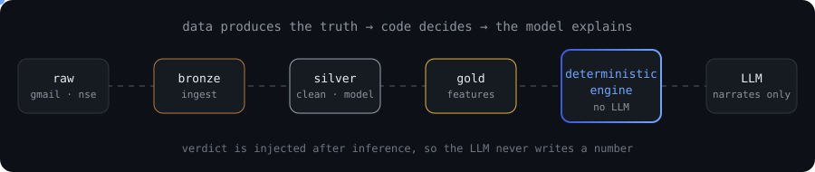

  

 

## ⚡ what I build

| | |
|---|---|
| 📈 **[INVR](https://github.com/gh0gale)** | AI stock advisor where the math is deterministic and the LLM only explains it |
| 💸 **[SpendStream](https://github.com/gh0gale)** | Turns your Gmail into spending insights with a self-improving classifier |
| 🚆 **[Travelr](https://github.com/gh0gale)** | Smart commute planner that matches you with people on your route |

 

## 🧰 tech stack

 

  

 

 

## 📊 github stats

  

 

## 📬 contact

  

pipelines over spreadsheets. systems over scripts. always.

