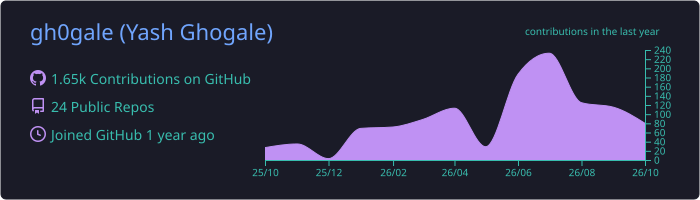
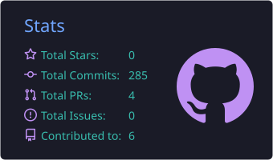
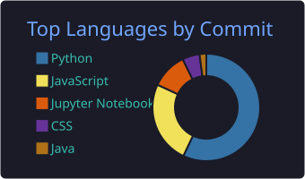
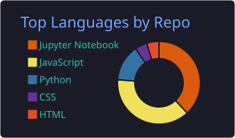
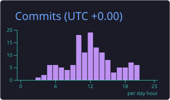

<div align="center">



<br>

[](https://portfolio-agent-gh0gale.vercel.app)
[](https://linkedin.com/in/yash-ghogale)
[](mailto:info.ghogale@gmail.com)

<br>


</div>

<br>

```text
 BRONZE  →  SILVER  →  GOLD
 raw        trusted    ready to use
```

I organise this page the way I organise data: **raw facts first, refined layers after, the polished result last.**

---

## 🥉 Bronze · who I am (raw)

```yaml
name:        Yash Ghogale
based_in:    Mumbai, India
studying:    B.Tech CSE (Data Science), DJSCE, 4th year
cgpa:        9.05
honors:      Computational Finance
worked_at:   Godrej Infotech (Analyst Intern, SQL Server / SSIS / SSAS)
believes:    "data produces the truth, code decides, the model explains"
status:      open to Data / AI Engineering roles
```

---

## 🥈 Silver · what I work with (cleaned and organised)

<div align="center">

| Layer | Tools |
|:--|:--|
| **store** |        |
| **transform** |       |
| **serve** |       |
| **intelligence** |        |
| **ship** |      |

</div>

---

## 🥇 Gold · what's ready to use

### Shipped

| | | |
|:--|:--|:--|
| 📈 **[INVR](https://github.com/gh0gale)** | AI stock advisor. Deterministic scoring, LLM only narrates. | `live` |
| 💸 **[SpendStream](https://github.com/gh0gale)** | Gmail to spending insights, with a classifier that learns from corrections. | `live` |
| 🚆 **[Travelr](https://github.com/gh0gale)** | Commute planner that matches you with people on your route. | `demo` |

### Telemetry

<div align="center">









<br><br>


</div>

---

## 📡 Reach me

```bash
$ open https://portfolio-agent-gh0gale.vercel.app    # portfolio
$ mail info.ghogale@gmail.com                         # email
$ open https://linkedin.com/in/yash-ghogale           # linkedin
```

<div align="center">
  <sub>pipelines over spreadsheets · systems over scripts · always</sub>
</div>
